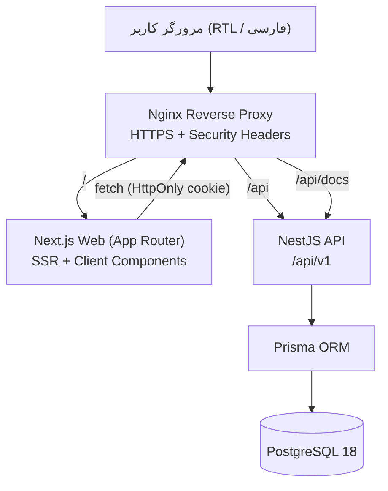
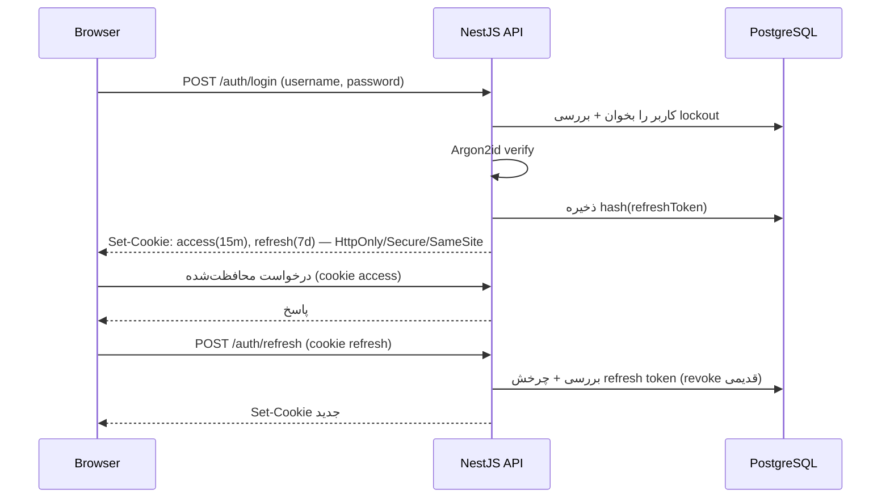

# معماری سامانه (Architecture)

سامانه پایش پیشرفت پروژه‌های استراتژیک به‌صورت **Monorepo** با `pnpm workspaces` پیاده‌سازی شده و شامل دو برنامهٔ مستقل (Frontend / Backend) و بسته‌های مشترک است.

## نمای کلی



## توپولوژی درخواست

```
Browser
  ↓
Nginx  (TLS termination, gzip, security headers, rate/limit, upload cap)
  ├── /            → Next.js Web (port 3000)
  ├── /api         → NestJS API (port 4000)
  └── /api/docs    → NestJS Swagger
                       ├── Prisma Client
                       └── PostgreSQL (volume‌دار، بدون Publish پورت در Production)
```

## ساختار Monorepo

```
project-monitoring-platform/
├── apps/
│   ├── web/          # Next.js 15 (App Router, TS strict, Tailwind, TanStack Query/Table, Recharts)
│   └── api/          # NestJS 11 (Prisma, JWT, RBAC, Swagger, Excel import/export)
├── packages/
│   ├── contracts/    # Enumها، Zod schema، DTO types، ثابت‌های مشترک بین web و api
│   ├── eslint-config/# پیکربندی مشترک ESLint
│   └── tsconfig/     # پیکربندی پایه TypeScript
├── references/       # فایل Excel و تصویر مرجع
├── docs/             # مستندات تحلیل، معماری و نگاشت
├── infrastructure/   # nginx، اسکریپت‌ها، backup
├── .github/workflows/# CI و Deploy
├── compose.yml       # محیط توسعه
├── compose.production.yml
├── pnpm-workspace.yaml
└── package.json
```

## لایه‌های Backend (NestJS)

- **Auth Module** — Login/Refresh/Logout/Me/ChangePassword، JWT کوتاه‌عمر + Refresh Token چرخشی، Argon2id، Login Lockout، Cookieهای HttpOnly/Secure/SameSite.
- **Users Module** — CRUD کاربران، Reset Password، فعال/غیرفعال، محافظت از آخرین ادیتور فعال.
- **Projects Domain** — Projects، Indicators، MonthlyProgress، Activities، Risks، Decisions با CRUD و عملیات Bulk و Optimistic Concurrency.
- **Dashboard Module** — یک Endpoint تجمیعی که DTO کامل داشبورد را در یک Query بهینه (بدون N+1) برمی‌گرداند.
- **Calculation** — `DashboardCalculationService` مستقل و تست‌شده؛ تنها منبع محاسبات (پیشرفت وزنی، تحقق، وضعیت فعالیت، انحراف).
- **Import/Export** — تحلیل و Import اتمیک فایل Excel در Transaction، و Export با جلوگیری از Formula Injection.
- **Audit Module** — ثبت تغییرات (قبل/بعد، IP، UserAgent) و فهرست با Filter.
- **Health Module** — liveness/readiness با بررسی واقعی اتصال دیتابیس.
- **Common** — Guardها (JwtAuthGuard، RolesGuard)، Decoratorها (@Roles، @CurrentUser)، Filter خطای سراسری با ساختار ثابت، Interceptor برای RequestId، Structured Logging (pino)، Helmet، Rate Limit.

## لایه‌های Frontend (Next.js App Router)

- **(auth)/login** — صفحه ورود امن RTL.
- **(dashboard)/dashboard** — داشبورد مدیریتی با نمودارها (Recharts)، حالت Fullscreen/Wallboard، Print Stylesheet.
- **(admin)/admin/**** — پنل‌های ویرایش پروژه/شاخص/پیشرفت ماهانه/فعالیت‌ها/ریسک‌ها/تصمیمات، Import، کاربران، Audit Log.
- **State/Data** — TanStack Query برای cache/invalidation، React Hook Form + Zod برای فرم‌ها، TanStack Table برای جدول‌ها، Zustand فقط برای UI state سراسری (مثل Fullscreen).
- **API access** — از طریق `fetch` با `credentials: 'include'`؛ Access Token فقط در Cookie HttpOnly (هرگز LocalStorage).

## جریان احراز هویت



## تصمیمات کلیدی معماری

- **Source of Truth**: پس از Import، PostgreSQL تنها منبع حقیقت است؛ فرمول‌های Excel در زمان اجرا استفاده نمی‌شوند.
- **محاسبات یک‌جا**: تمام فرمول‌ها فقط در `DashboardCalculationService` قرار دارند و در Frontend تکرار نمی‌شوند.
- **RBAC در Backend**: کنترل دسترسی همیشه سمت سرور با Guard و Decorator اعمال می‌شود؛ مخفی‌کردن دکمه در Frontend صرفاً UX است.
- **Optimistic Concurrency**: مدل `Project` دارای `version` است و ویرایش هم‌زمان با HTTP 409 مدیریت می‌شود.
- **تاریخ**: ذخیره به‌صورت `Date` استاندارد در Postgres + نگهداری `jalaliYear`/`jalaliMonth` برای مرتب‌سازی؛ نمایش جلالی در UI با Timezone `Asia/Tehran`.
